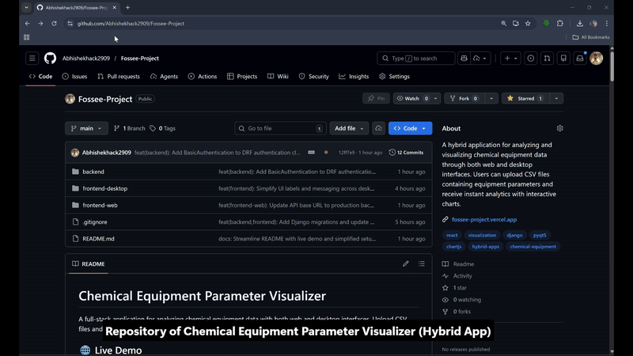

# Chemical Equipment Parameter Visualizer


A hybrid application for analyzing and visualizing chemical equipment data through both web and desktop interfaces. Upload CSV files with chemical equipment data and get instant analytics with charts.

## Architecture

<div align="center">

```
┌─────────────────┐      ┌─────────────────┐
│  React Web App  │      │ PyQt5 Desktop   │
│  (Chart.js)     │      │ (Matplotlib)    │
└────────┬────────┘      └────────┬────────┘
         │ Token Auth             │ Basic Auth
         └──────────┬─────────────┘
                    ▼
         ┌─────────────────────┐
         │  Django REST API    │
         │  (Pandas Processing)│
         └──────────┬──────────┘
                    ▼
         ┌─────────────────────┐
         │   SQLite Database   │
         └─────────────────────┘
```

</div>

## Demo



## Live Demo

**Try it here**: https://fossee-project.vercel.app/

Upload a CSV file to view the analysis results instantly.

## Features

- **CSV Analysis**: Upload equipment data and receive statistical summaries (count, averages for flowrate/pressure/temperature)
- **Equipment Visualization**: Interactive charts showing equipment type distribution
- **Upload History**: Maintains last 5 upload records for reference
- **PDF Reports**: Generate downloadable analysis reports
- **Cross-Platform**: Access via web browser or native desktop application
- **Dual Authentication**: Token-based auth (web) and Basic Authentication (desktop/API)

## Tech Stack

- **Web**: React + Chart.js
- **Desktop**: PyQt5 + Matplotlib
- **Backend**: Django REST Framework
- **Database**: SQLite
- **Data**: Pandas

## Setup Instructions

### Option 1: Use the Live Web App (No Setup Required)

Just go to https://fossee-project.vercel.app/ and upload your CSV file. Everything is already running in the cloud.

### Option 2: Run Everything Locally

#### Before You Start

Make sure you have these installed:

- **Python 3.9+**: https://www.python.org/downloads/
- **Node.js 16+**: https://nodejs.org/
- **Git**: https://git-scm.com/downloads

#### Clone the Repository

```bash
git clone https://github.com/Abhishekhack2909/Fossee-Project.git
cd Fossee-Project
```

#### Step 1: Set Up the Backend

Open your terminal and run these commands one by one:

```bash
# Go to the backend folder
cd backend

# Install all the required Python packages
pip install -r requirements.txt

# Set up the database
python manage.py migrate

# Create your own Admin User (Required for Basic Auth testing)
python manage.py createsuperuser
# (You will be prompted to create your own username and password)

# Start the backend server
python manage.py runserver
```

The backend will start at `http://127.0.0.1:8000`. Keep this terminal window open.

#### Step 2: Set Up the Web Frontend

Open a new terminal window and run:

```bash
# Go to the web frontend folder
cd frontend-web

# Install all the required packages
npm install

# Start the web app
npm start
```

Your browser will automatically open to `http://localhost:3000`. If it doesn't, just type that URL in your browser.

#### Step 3: Run the Desktop App

Open a new terminal window and run:

```bash
# Go to the desktop app folder
cd frontend-desktop

# Install the required packages
pip install -r requirements.txt

# Run the desktop application
python main.py
```

**Note:** By default, the Desktop App connects to your Local Backend (`http://127.0.0.1:8000`). Ensure Step 1 is running first.

## CSV Format

Your CSV needs these columns:

```
Equipment Name, Type, Flowrate, Pressure, Temperature
```

Example:

```csv
Equipment Name,Type,Flowrate,Pressure,Temperature
Pump-001,Pump,150.5,25.3,45.2
Valve-001,Valve,0,15.6,42.1
Heat-Exchanger-001,Heat Exchanger,200.3,30.5,85.4
```

## Project Structure

```
├── backend/              # Django API
├── frontend-web/         # React web app
├── frontend-desktop/     # PyQt5 desktop app
└── README.md
```

## Design Decisions

| Decision                       | Rationale                                                                       |
| ------------------------------ | ------------------------------------------------------------------------------- |
| **PyQt5** for desktop          | Aligns with Python scientific ecosystem commonly used in FOSSEE projects        |
| **Pandas** for data processing | Industry-standard library for CSV parsing and statistical analysis              |
| **SQLite** for storage         | Lightweight, zero-configuration database suitable for single-user local history |
| **Django REST Framework**      | Mature framework with built-in authentication and serialization support         |
| **Chart.js / Matplotlib**      | Platform-appropriate charting libraries for web and desktop respectively        |

## Deployment

| Component    | Platform            |
| ------------ | ------------------- |
| Web Frontend | Vercel              |
| Backend API  | Render              |
| Database     | SQLite (file-based) |

## Troubleshooting

| Issue                 | Solution                                                                       |
| --------------------- | ------------------------------------------------------------------------------ |
| Backend not starting  | Ensure Python 3.9+ is installed and run `pip install -r requirements.txt`      |
| Web app not loading   | Check Node.js version; try deleting `node_modules` and run `npm install` again |
| Desktop app crashes   | Install PyQt5: `pip install PyQt5`                                             |
| Upload fails          | Verify CSV has correct columns and is UTF-8 encoded                            |
| "Staticfiles" warning | Safe to ignore — this is a cloud deployment setting                            |
